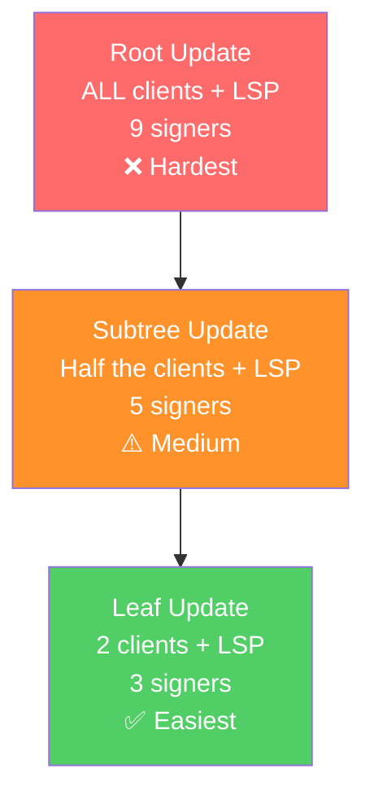
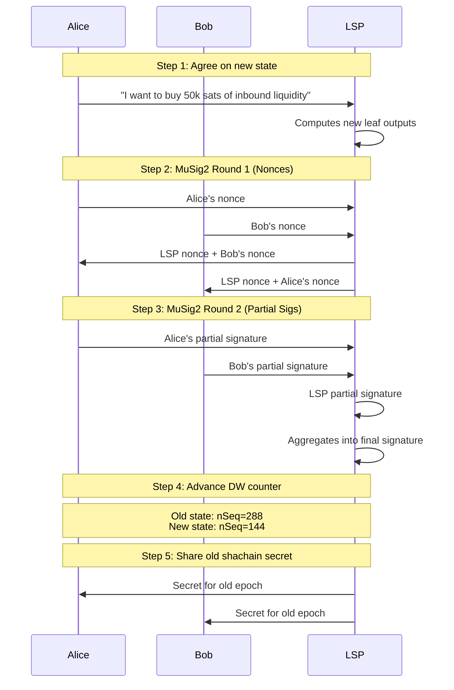

# Updating State

> **Summary**: When clients buy liquidity or channels need restructuring, the factory's state must advance. A leaf update only needs 3 signers (2 clients + LSP). Each update ticks the odometer and produces a new set of pre-signed transactions with lower nSequence values.

## What Triggers a State Update?

State updates happen at the **factory level**, not for regular Lightning payments. Regular payments flow through the leaf channels using standard Poon-Dryja mechanics and don't consume factory states.

Factory state updates are triggered by:

| Trigger | Example | Scope |
|---------|---------|-------|
| **Liquidity purchase** | Alice buys inbound liquidity from LSP | Leaf update (3 signers) |
| **Channel rebalance** | Move liquidity from one subtree to another | Subtree or root update |
| **Client exit** | Bob leaves the factory | Leaf update or subtree update |
| **New client** | New client joins (rare, usually happens at factory creation) | Root update (all signers) |

## Update Scope: Who Needs to Be Online?

This is one of SuperScalar's key advantages — **most updates are local**:



| Update Level | Who Must Be Online | How Common |
|-------------|-------------------|-----------|
| Leaf state (Layer 1) | 2 local clients + LSP | **Very common** |
| One level up | 4 clients in half-tree + LSP | Occasional |
| Root state (Layer 0) | All clients + LSP | Rare |

**Most updates are leaf updates.** The whole point of the tree structure is to keep updates local.

## How a Leaf Update Works

Say Alice wants to buy inbound liquidity from the LSP. Alice and Bob are in the same leaf:



### What Changed?

**Before (epoch 4):**
```
state_left (nSeq = 288):
  - Alice & LSP channel: 100k sats
  - Bob & LSP channel: 80k sats
  - LSP liquidity stock: 200k sats
```

**After (epoch 5):**
```
state_left (nSeq = 144):
  - Alice & LSP channel: 150k sats (50k more inbound)
  - Bob & LSP channel: 80k sats (unchanged)
  - LSP liquidity stock: 150k sats (50k less — sold to Alice)
```

The [[the-odometer-counter|odometer]] ticked from epoch 4 to epoch 5. The new state transaction has a **lower nSequence** (144 vs 288), so it will always beat the old state on-chain.

## The Odometer Tick

Each leaf update ticks the **inner layer** of the odometer. When the inner layer exhausts all states:

```
Epoch 3:  Layer0=432, Layer1=0     (inner layer exhausted — all states used)
Epoch 4:  Layer0=288, Layer1=432   (CARRY! Outer ticks, inner resets)
```

A carry requires a **higher-level update** — more signers must be online to sign the new root-level state transaction. This is rare (happens every K leaf updates, where K is states per layer).

## Why Bob Has to Participate

Even though Bob's channel didn't change, Bob must sign the new leaf state transaction. Why?

1. The leaf state transaction is a **3-of-3 MuSig2** (Alice, Bob, LSP)
2. All three must sign ANY new version of the leaf state
3. This ensures Bob consents to the new state — preventing the LSP from secretly moving Bob's funds

### What If Bob Is Offline?

If Bob is offline, Alice can't do a leaf update. Options:

1. **Wait** for Bob to come online (push notification)
2. **Incentivize Bob** — the LSP might offer Bob a small amount of free inbound liquidity as compensation for waking up
3. **Higher-level update** — restructure the subtree (requires more signers, more complex)

> *"When B is woken up to help A: LSP offers B a small amount of free inbound liquidity as compensation."* — ZmnSCPxj

## What Doesn't Consume Factory State

**Regular Lightning payments within leaf channels do NOT update factory state.** Once Alice has a channel with the LSP at the leaf, she can:

- Send payments through the LSP to the wider Lightning network
- Receive payments via the LSP
- Route payments (if configured)

All of this uses standard Lightning commitment transactions within the Alice-LSP channel. The factory tree is not involved. Factory state is only consumed by **structural changes** (liquidity purchases, channel opens/closes, rebalancing).

## Related Concepts

- [[the-odometer-counter]] — How state epochs are tracked
- [[decker-wattenhofer-invalidation]] — Why lower nSequence beats higher
- [[shachain-revocation]] — The secrets shared when invalidating old states
- [[building-a-factory]] — How the initial state was created
- [[cooperative-close]] — What happens at the end of the factory's life
