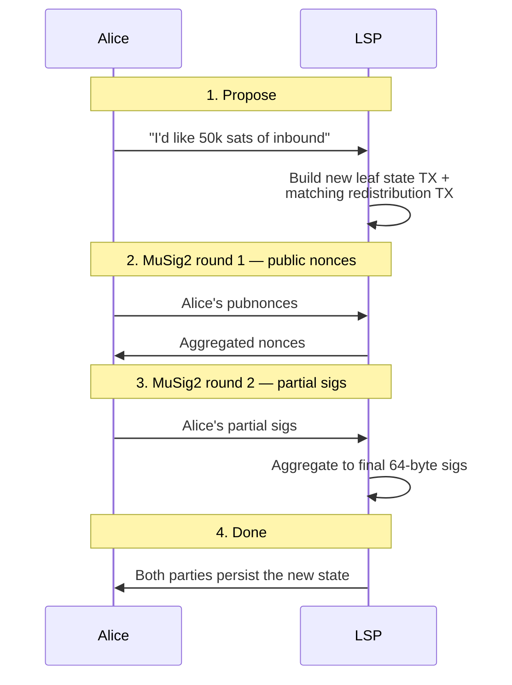

# Updating State

> **Summary**: SuperScalar's tree state changes entirely off-chain. Different kinds of changes wake up different participants — most of the time just one client + LSP, occasionally a sub-factory's cohort, very rarely the whole tree. None of them broadcast a transaction on chain; what changes is the set of pre-signed transactions everyone is holding.

## When does the factory tree change?

Two things are happening at once inside a factory, and only one of them touches the tree:

- **Lightning payments** flow through the inner BOLT-2 channel inside each leaf. They use standard Lightning commitment-update mechanics. **The factory tree is not involved.**
- **Structural changes** — buying liquidity, extending a leaf's PS chain, refreshing the factory's lifetime — do update the tree. These are what this page is about.

Every structural change is a signing ceremony. Nobody broadcasts a transaction. The participants just replace the pre-signed transaction set they were each holding with a new one. On-chain, nothing happens.

## Three sizes of ceremony

The ceremonies form a small hierarchy by how many participants need to wake up:

```mermaid
graph TD
    PL["<b>Per-leaf advance</b><br/>1 client + LSP<br/><i>very common</i>"]
    SF["<b>Sub-factory chain extension</b><br/>sub-factory cohort + LSP<br/><i>opt-in (k≥2 deployments)</i>"]
    FR["<b>Factory refresh</b><br/>all clients + LSP<br/><i>rare</i>"]

    style PL fill:#15aabf,color:#fff
    style SF fill:#fcc419,color:#000
    style FR fill:#fa5252,color:#fff
```

The rest of this page walks through each one, from most common to rarest.

---

## Per-leaf advance

> One client + LSP. The workhorse — every liquidity buy, every leaf-local state change.

A leaf's [[pseudo-spilman-leaves|PS chain]] gets extended by one TX. The signing cohort is just the one client whose leaf it is, plus the LSP.

### The flow

```mermaid
sequenceDiagram
    participant A as Alice
    participant L as LSP

    Note over A,L: 1. Propose
    A->>L: "I'd like 50k sats of inbound"
    L->>L: Build new leaf state TX +<br/>matching redistribution TX

    Note over A,L: 2. MuSig2 round 1 — public nonces
    A->>L: Alice's pubnonces
    L->>A: Aggregated nonces

    Note over A,L: 3. MuSig2 round 2 — partial sigs
    A->>L: Alice's partial sigs
    L->>L: Aggregate to final 64-byte sigs

    Note over A,L: 4. Done
    L->>A: Both parties persist the new state
```

### What both parties hold afterwards

- The new PS state TX (one TX deeper into the leaf's chain), pre-signed but not broadcast
- The matching pre-signed [[l-stock-redistribution|redistribution TX]] for the new state's L-stock UTXO
- The previous state's redistribution TX, still valid against the previous state's L-stock UTXO if the LSP ever publishes that old state

### What does NOT happen

Nothing on chain. No funding-output spend, no miner fee, no confirmation wait. The chain is unaware that any of this took place.

### What if the LSP is offline

Alice waits. There's no on-chain timeout pressure for a leaf advance — the leaf just sits at its current state until the LSP comes back online.

### What if Alice is offline

The LSP waits, typically with a push notification to nudge Alice to come online. The leaf can't advance until she does.

### Crash safety

Both parties persist their partial signature *before* sending the wire reply. If anyone crashes mid-ceremony, the retry sees the persisted record and resumes cleanly. A per-leaf double-sign defense ensures you cannot accidentally sign two different children for the same parent UTXO.

---

## Sub-factory chain extension

> The sub-factory's cohort + LSP. Only active when the LSP deploys with sub-factory arity ≥ 2. Triggered when a leaf's PS chain has burned through its channel-output value via per-advance fees.

A PS leaf's chain can extend in principle, but each chain TX consumes a small amount of channel value as fee. Eventually the channel runs low and the chain needs more headroom.

When the LSP deploys with **sub-factory arity ≥ 2** (the t/1242 k² shape — `k` clients per sub-factory, `k²` clients per leaf), each leaf carries one or more pre-built sub-factories. When a leaf's channel runs low, a sub-factory chain extension ceremony inserts a fresh allocation from that sub-factory's sales-stock, and the leaf keeps chaining.

The ceremony shape is the same as per-leaf advance — two-round MuSig2, bundled redistribution-TX co-signing — just with a larger cohort (the LSP plus the `k` clients in that sub-factory).

**Note on deployment shape.** The default deployment is `k = 1`: one client per leaf, no sub-factories. In a default deployment, sub-factory chain extension never fires, and the per-leaf advance is the only common ceremony. Operators who deploy at `k ≥ 2` (to support more clients per leaf with fewer DW layers) opt into the sub-factory machinery.

---

## Factory refresh

> All clients + LSP. Rare. Replaces the whole pre-signed transaction set in place — same on-chain UTXO, fresh CLTV.

When a factory's lifetime is approaching its CLTV timeout, normally the LSP rotates it: cooperatively close the old factory, open a new one. That costs one on-chain transaction and resets everyone.

A refresh skips the on-chain step. The same factory continues with a fresh CLTV; only the pre-signed transaction set is replaced. Cheaper, but requires the factory's composition to stay the same — every existing client has to participate in the ceremony to consent to the refresh.

It's also what runs if the interior DW counter ever rolls over and needs reset.

### Why it's rare

A factory's normal life is mostly per-leaf advances. Whole-tree refreshes happen at most a couple of times across the factory's months-long lifetime.

### How it compares to rotation

| | Rotation | Refresh |
|---|---|---|
| Same on-chain UTXO? | No (new factory funded) | Yes |
| On-chain TXs | 1 (close + new fund, combined) | 0 |
| Composition can change? | Yes | No |
| When to use | End-of-life with shape or composition change | Same composition, just need fresh CLTV |

Rotation is described in [[laddering]]; refresh is its lower-cost in-place alternative.

---

## What does NOT consume factory state

| Action | Touches the factory tree? |
|---|---|
| Sending a Lightning payment through the LSP | No — inner channel commit-update only |
| Receiving a Lightning payment | No — same |
| Routing through the LSP | No — same |
| Buying inbound liquidity from the LSP | **Yes** — per-leaf advance |
| Extending a leaf's PS chain when its channel fills up | **Yes** — sub-factory chain extension |
| Refreshing the factory's CLTV without rotation | **Yes** — factory refresh |
| Cooperative close + migration to a new factory | This is rotation, not an update — see [[laddering]] |

Regular Lightning operations stay inside the leaf's BOLT-2 channel. Only structural changes to the factory itself need one of the three ceremonies above.

---

## Why off-chain ceremonies are binding

An old version of the tree's state is replaced not by broadcast but by everyone collectively discarding it. As long as no one broadcasts the now-old transactions, the new state is what counts.

If a malicious party does broadcast an old state to try to roll back:

- At the **interior tree layers**, [[decker-wattenhofer-invalidation|DW invalidation]] ensures the newer state wins the on-chain race.
- At the **leaves**, [[pseudo-spilman-leaves|PS chain ordering]] ensures the newer state's input already consumed the old state's child UTXO — old states are structurally invalidated.
- The **LSP's liquidity stock** in any stale state is protected by the pre-signed [[l-stock-redistribution|redistribution TX]] that fires if the stale state ever lands on chain.

Together, these mean an off-chain replacement is as binding as an on-chain commitment, without the on-chain cost.

## Related Concepts

- [[pseudo-spilman-leaves]] — TX chaining mechanism that per-leaf advance extends
- [[l-stock-redistribution]] — Pre-signed cheating-recovery TX co-signed in every ceremony
- [[building-a-factory]] — The initial signing ceremony that creates the first state
- [[laddering]] — Where factory refresh fits into a factory's end-of-life
- [[cooperative-close]] — The other end-of-life path (rotation, not refresh)
