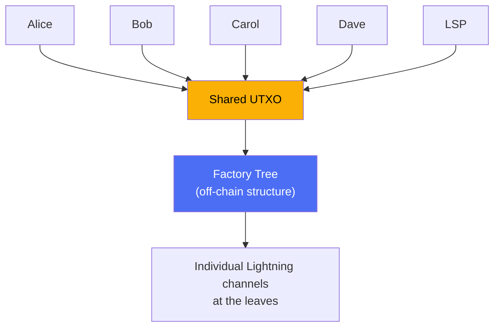

# SuperScalar

> SuperScalar enables multiple users to share a single on-chain UTXO for non-custodial Lightning channel access without requiring consensus changes.

## Motivation

Each Lightning channel requires a dedicated on-chain UTXO, which is a bottleneck given Bitcoin's limited throughput (~7 tx/sec). Users with no on-chain Bitcoin cannot open channels independently.

## Overview

SuperScalar lets many users share a single on-chain UTXO through an off-chain factory tree, using pre-signed transaction trees and N-of-N multisig rather than covenant opcodes. One LSP (Lightning Service Provider) coordinates the factory.

**Properties:**

- **Shared UTXO**: Many users share one on-chain UTXO instead of each needing their own.
- **Non-custodial**: N-of-N multisig means no single party — including the LSP — can move funds alone.
- **Unilateral exit**: If the LSP disappears, every user can force-close on-chain without anyone's permission.
- **No on-chain Bitcoin required**: Users can be onboarded with zero existing funds. The LSP provides initial liquidity.
- **No consensus changes**: This works on Bitcoin **today**. No soft fork needed.

At the leaves of the factory tree, each user gets a standard Lightning channel (Poon-Dryja) with the LSP. The distinguishing property is that these channels are backed by a shared UTXO rather than individual ones.

## Key Mechanisms

SuperScalar combines three mechanisms:

1. **[[decker-wattenhofer-invalidation]]** — Decrementing relative timelocks ensure newer state transactions confirm before older ones during unilateral close
2. **[[timeout-sig-trees]]** — N-of-N multisig with CLTV timeout fallback so the LSP can recover capital if clients disappear
3. **[[laddering]]** — Multiple factories with staggered lifetimes spread the on-chain footprint to ~1 tx/day

## Who Is This For?

| Audience | Start Here |
|----------|-----------|
| **General overview** | Continue reading below |
| **Lightning developers unfamiliar with factories** | [[why-superscalar-exists]] → [[decker-wattenhofer-invalidation]] → [[factory-tree-topology]] |
| **Full technical specification** | [[building-a-factory]] → [[updating-state]] → [[force-close]] |
| **Comparison with alternative designs** | [[comparison-to-ark]] → [[security-model]] → [[soft-fork-landscape]] |

## Reading Order

### Foundations (if you need them)
1. [[what-is-a-payment-channel]] — How two people share a UTXO
2. [[what-is-multisig]] — Requiring multiple keys to authorize a spend
3. [[what-is-taproot]] — Key-path and script-path spending for compact on-chain footprint
4. [[what-is-musig2]] — How N people produce one signature
5. [[what-is-nsequence]] — Relative timelocks used by Decker-Wattenhofer
6. [[what-is-an-lsp]] — The node that coordinates a factory

### Core Concepts
1. [[decker-wattenhofer-invalidation]] — The time-delay state machine
2. [[the-odometer-counter]] — How layers multiply state capacity
3. [[timeout-sig-trees]] — N-of-N signing with LSP timeout fallback
4. [[factory-tree-topology]] — The tree structure explained
5. [[kickoff-vs-state-nodes]] — Why the tree alternates node types
6. [[shachain-revocation]] — Secret-based penalty for stale LSP state broadcasts
7. [[laddering]] — Factory rotation and lifecycle

### How It Works
1. [[building-a-factory]] — Step-by-step construction
2. [[updating-state]] — What happens when factory state changes
3. [[cooperative-close]] — The happy path
4. [[force-close]] — When someone disappears
5. [[client-migration]] — Moving between factories

### Deep Dives
- [[musig2-signing-rounds]] — The 2-round signing protocol
- [[tapscript-construction]] — Building Taproot script trees
- [[transaction-structure]] — Actual Bitcoin transaction format
- [[security-model]] — Trust assumptions and threat model

### Context
- [[why-superscalar-exists]] — The scaling problem in depth
- [[comparison-to-ark]] — Different trust models compared
- [[soft-fork-landscape]] — CTV, APO, OP_CAT and what they'd change
- [[history-and-origins]] — ZmnSCPxj, Spiral (Block), and the Delving Bitcoin thread

### Extensions (Future Roadmap)
- [[splicing-integration]] — Resizing channels inside factories
- [[pluggable-factories]] — Plugging into existing LN software
- [[dual-state-management]] — Handling factory transitions safely
- [[jit-channel-fallbacks]] — On-chain safety net when factories can't help
- [[ephemeral-anchors]] — v3 transactions, P2A outputs, and fee management

### Research
- [[research-horizon]] — Nested MuSig2, async payments, factory watchtowers, PTLCs, FROST/VLS, and other technologies worth watching

---

## Origin

SuperScalar was designed by **ZmnSCPxj** (funded by Spiral, Block's open-source arm) and published on [Delving Bitcoin](https://delvingbitcoin.org) in September 2024. The design combines ideas from Christian Decker & Roger Wattenhofer's 2015 paper on duplex micropayment channels with timeout trees and the MuSig2 signing protocol.

ZmnSCPxj's original post described the design without an accompanying implementation. This documentation accompanies an implementation in progress.

> *"The goal of SuperScalar is to be able to onboard people, possibly people who do not have an existing UTXO they can use to pay exogenous fees."* — ZmnSCPxj
