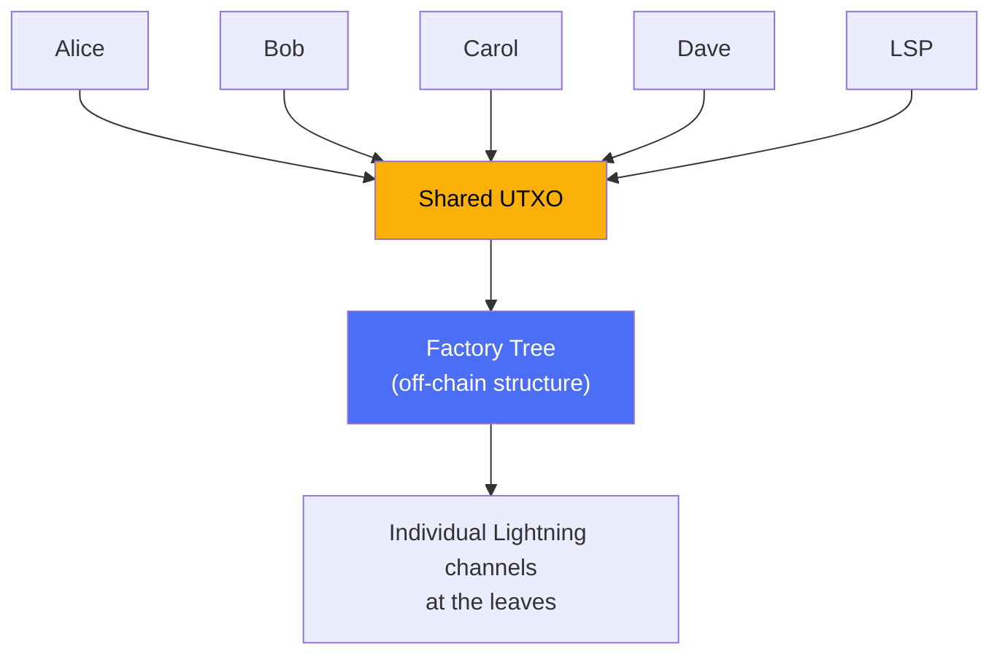

# SuperScalar

> SuperScalar enables multiple users to share a single on-chain UTXO for non-custodial Lightning channel access without requiring consensus changes.

## Motivation

Each Lightning channel requires a dedicated on-chain UTXO, which is a bottleneck given Bitcoin's limited throughput (≈7 tx/sec). Users with no on-chain Bitcoin cannot open channels independently.

## Overview

SuperScalar lets many users share a single on-chain UTXO through an off-chain factory tree, using pre-signed transaction trees and N-of-N multisig rather than covenant opcodes. One LSP (Lightning Service Provider) coordinates the factory.

```mermaid
graph TD
    A["Alice"] --> U["Shared UTXO"]
    B["Bob"] --> U
    C["Carol"] --> U
    D["Dave"] --> U
    LSP["LSP"] --> U
    U --> T["Factory Tree<br/>(off-chain structure)"]
    T --> CH["Individual Lightning channels<br/>at the leaves"]

    style U fill:#fab005,color:#000
    style T fill:#4c6ef5,color:#fff
```

**Properties:**

- **Shared UTXO**: Many users share one on-chain UTXO instead of each needing their own.
- **Non-custodial**: N-of-N multisig means no single party — including the LSP — can move funds alone.
- **Unilateral exit**: If the LSP disappears, every user can force-close on-chain without anyone's permission.
- **No on-chain Bitcoin required**: Users can be onboarded with zero existing funds. The LSP provides initial liquidity.
- **No consensus changes**: This works on Bitcoin **today**. No soft fork needed.

At the leaves of the factory tree, each user gets a Lightning channel inside a **pseudo-Spilman (PS) leaf** (see [[pseudo-spilman-leaves]]). PS leaves are the canonical leaf mechanism — TX chaining replaces decrementing nSequence at the leaf level, so leaves use no relative timelock budget and need no per-leaf revocation keys.

## Key Mechanisms

The current SuperScalar design (per ZmnSCPxj's [t/1242 refinement](https://delvingbitcoin.org/t/superscalar-laddered-timeout-tree-structured-decker-wattenhofer-factories-with-pseudo-spilman-leaves/1242)) combines:

1. **[[pseudo-spilman-leaves]]** — Canonical leaf mechanism. TX chaining: each state advance produces a new TX that spends the previous state's channel output, so old states cannot be activated without invalidating the chain ancestor. No nSequence delay, no revocation keys, no per-leaf watchtower needed.
2. **[[l-stock-redistribution|L-stock SPK + Redistribution TX]]** — Per-leaf liquidity-stock output is `or(N-of-N MuSig, L+CSV)`. At every state advance, a pre-signed *redistribution transaction* is co-signed that redistributes the L-stock equally to clients if the LSP publishes a stale state. Replaces the older OP_RETURN burn from t/1143.
3. **[[tree-shaping-and-multi-process|Mixed-arity tree shape]]** — Interior layers fan out at independently-configurable arities (e.g. `--arity 2,4,8`), with optional static-near-root depths that contribute no DW counter. Keeps worst-path exit time inside BOLT's 2016-block CLTV ceiling at N=128 clients per factory.
4. **[[timeout-sig-trees]]** — N-of-N multisig key-path with CLTV timeout script-path fallback so the LSP can recover capital if clients disappear permanently.
5. **[[decker-wattenhofer-invalidation]]** — Decrementing relative timelocks. Applies to the interior tree layers above the PS leaves; the leaves themselves use TX chaining instead.
6. **[[laddering]]** — Multiple factories with staggered lifetimes spread the on-chain footprint to ≈1 tx/day. A factory can also be refreshed in place without anyone migrating.

## Reading Order

See [[roadmap]] for the development plan and [[network-economics]] for cost and capital model.

<strong>Prerequisites</strong> — Primer on payment channels, Taproot, MuSig2, and timelocks

1. [[what-is-a-payment-channel]] — How two people share a UTXO
2. [[what-is-multisig]] — Requiring multiple keys to authorize a spend
3. [[what-is-taproot]] — Key-path and script-path spending for compact on-chain footprint
4. [[what-is-musig2]] — How N people produce one signature
5. [[what-is-nsequence]] — Relative timelocks used by Decker-Wattenhofer
6. [[what-is-an-lsp]] — The node that coordinates a factory

### Protocol Design — Current (Pseudo-Spilman era)
1. [[pseudo-spilman-leaves]] — Canonical leaf mechanism (TX chaining)
2. [[l-stock-redistribution|L-stock SPK + Redistribution TX]] — Cheating recovery via per-client redistribution
3. [[tree-shaping-and-multi-process|Mixed-arity, sub-factories, multi-process]] — Tree shape configuration that keeps N=128 inside BOLT 2016
4. [[factory-tree-topology]] — The tree structure
5. [[kickoff-vs-state-nodes]] — Why interior layers alternate
6. [[timeout-sig-trees]] — N-of-N signing with LSP timeout fallback
7. [[laddering]] — Factory rotation and lifecycle

### Protocol Design — Underlying primitives (still load-bearing for interior layers)
1. [[decker-wattenhofer-invalidation]] — The time-delay state machine (interior layers only under the PS-canonical design)
2. [[the-odometer-counter]] — How DW layers multiply state capacity
3. [[shachain-revocation|Revocation Secrets]] — Per-commit revocation, still used inside the BOLT-2 channels that ride on top of the PS leaves

### Protocol Operations
1. [[building-a-factory]] — Step-by-step construction
2. [[updating-state]] — What happens when factory state changes
3. [[cooperative-close]] — The ideal factory shutdown
4. [[force-close]] — When someone disappears
5. [[client-migration]] — Moving between factories

### Technical Reference
- [[transaction-structure]] — Actual Bitcoin transaction format
- [[tapscript-construction]] — Building Taproot script trees
- [[musig2-signing-rounds]] — The 2-round signing protocol
- [[dual-state-management]] — How leaf channels survive factory state transitions
- [[ephemeral-anchors]] — P2A fee bumping for pre-signed transactions
- [[security-model]] — Trust assumptions and threat model

### Advanced
- [[splicing-integration]] — Resizing channels inside factories
- [[jit-channel-fallbacks]] — On-chain safety net when factories can't help
- [[cooperative-factories]] — Multi-LSP and user-cooperative factory topologies

### Research
- [[research-horizon]] — Nested MuSig2, async payments, factory watchtowers, PTLCs, FROST/VLS, and other technologies worth watching

---

## Implementation

The reference implementation is available at [github.com/8144225309/SuperScalar](https://github.com/8144225309/SuperScalar).

| Component | Status |
|-----------|--------|
| Factory construction (N-of-N MuSig2 tree signing) | Working |
| Pseudo-Spilman leaves (TX chaining, canonical) | Working |
| L-stock SPK + per-client redistribution TX (canonical, t/1242) | Working |
| Mixed-arity interior + static-near-root tree shapes | Working (verified to N=128) |
| In-place whole-tree CLTV refresh | Working |
| Force close / unilateral exit | Working |
| PTLC assisted exit (key turnover) | Working |
| Factory laddering with auto-rotation | Working |
| Watchtower (old-state monitoring + penalty broadcast) | Working |
| Sub-1-sat/vB fee support with automatic P2A anchor control | Working |

The implementation is written in C, with 1377 unit + 42 regtest + 30 signet exhibition tests, and CI on Linux, macOS, and ARM64. It links against `secp256k1-zkp` for MuSig2/Schnorr and `libsqlite3` for state persistence.

## Origin

SuperScalar was designed by **ZmnSCPxj** (funded by Spiral, Block's open-source arm) and published on [Delving Bitcoin](https://delvingbitcoin.org) in September 2024. The canonical leaf mechanism (pseudo-Spilman) and the L-stock + redistribution TX mechanism were introduced in the November 2024 refinement, [SuperScalar with Pseudo-Spilman Leaves](https://delvingbitcoin.org/t/superscalar-laddered-timeout-tree-structured-decker-wattenhofer-factories-with-pseudo-spilman-leaves/1242).

> *"The goal of SuperScalar is to be able to onboard people, possibly people who do not have an existing UTXO they can use to pay exogenous fees."* — ZmnSCPxj
