# SuperScalar: The First Explainer

> **One UTXO. Many users. Each gets their own non-custodial Lightning channel. No soft fork required.**

## The Problem

Right now, to use Lightning Network, you need to already own Bitcoin on-chain. You need a UTXO to open a channel. That's a chicken-and-egg problem for billions of potential users — especially people in developing nations using mobile wallets who have **zero on-chain Bitcoin** to start with.

Every Lightning channel today is a 2-of-2 multisig between you and your channel partner. That means **one on-chain UTXO per user**. If a million people want Lightning channels, that's a million on-chain transactions just to get started. Bitcoin can handle ~7 transactions per second. Do the math — it doesn't work.

## The Solution: SuperScalar

SuperScalar lets a **Lightning Service Provider (LSP)** — think of it as the company running your wallet's backend — create a single shared structure on-chain that gives **many users** their own individual, non-custodial Lightning channels.

```mermaid
graph TD
    F["🔒 One Funding UTXO<br/>(shared by everyone)"] --> T["Factory Tree<br/>(off-chain structure)"]
    T --> A["Alice's Channel<br/>with LSP"]
    T --> B["Bob's Channel<br/>with LSP"]
    T --> C["Carol's Channel<br/>with LSP"]
    T --> D["Dave's Channel<br/>with LSP"]
    T --> L["LSP's Liquidity<br/>Stock"]
```

**The key properties:**

- **Non-custodial**: The LSP cannot steal your funds. Ever. The structure uses N-of-N multisig, meaning the LSP is just one signer among many.
- **Unilateral exit**: If the LSP disappears or misbehaves, every user can force-close their channel on-chain without anyone's permission.
- **No on-chain Bitcoin required**: Users can be onboarded with zero existing funds. The LSP provides the initial liquidity.
- **No consensus changes**: This works on Bitcoin **today**. No soft fork needed.

## How Does It Actually Work?

SuperScalar combines three existing ideas into something new:

### 1. [[decker-wattenhofer-invalidation|Decker-Wattenhofer Invalidation]]
A trick using **time delays** so that newer versions of the shared state always beat older ones on-chain. If someone broadcasts an old, outdated state, the current state will confirm first because it has a shorter delay.

### 2. [[timeout-sig-trees|Timeout-Sig-Trees]]
The shared UTXO is locked behind an **N-of-N multisig** (everyone signs together) with a **timeout fallback** — if users disappear, the LSP can recover its capital after a set time. This prevents funds from being locked forever.

### 3. [[laddering|Laddering]]
Instead of one giant factory, the LSP runs **~33 factories at once** with staggered lifetimes. Each day one factory expires and a new one is created. Users migrate their funds during a 3-day window. This spreads the on-chain footprint to roughly **1 transaction per day** in the best case.

## Who Is This For?

| Audience | Start Here |
|----------|-----------|
| **"I just want to understand what this is"** | You're in the right place. Keep reading below. |
| **"I know Lightning but not factories"** | [[why-superscalar-exists]] → [[decker-wattenhofer-invalidation]] → [[factory-tree-topology]] |
| **"I want the full technical picture"** | [[building-a-factory]] → [[updating-state]] → [[force-close]] |
| **"I'm evaluating this vs Ark / other designs"** | [[comparison-to-ark]] → [[security-model]] → [[soft-fork-landscape]] |

## Reading Order

### Foundations (if you need them)
1. [[what-is-a-payment-channel]] — How two people share a UTXO
2. [[what-is-multisig]] — Why N-of-N means nobody can cheat alone
3. [[what-is-taproot]] — The Bitcoin upgrade that makes this efficient
4. [[what-is-musig2]] — How N people produce one signature
5. [[what-is-nsequence]] — Relative timelocks: the core trick
6. [[what-is-an-lsp]] — The business that runs your wallet's backend

### Core Concepts
1. [[decker-wattenhofer-invalidation]] — The time-delay state machine
2. [[the-odometer-counter]] — How layers multiply state capacity
3. [[timeout-sig-trees]] — N-of-N signing with LSP timeout fallback
4. [[factory-tree-topology]] — The tree structure explained
5. [[kickoff-vs-state-nodes]] — Why the tree alternates node types
6. [[shachain-revocation]] — How cheating gets punished
7. [[laddering]] — Factory rotation and lifecycle

### How It Works
1. [[building-a-factory]] — Step-by-step construction
2. [[updating-state]] — What happens when Alice pays Bob
3. [[cooperative-close]] — The happy path
4. [[force-close]] — When someone disappears
5. [[client-migration]] — Moving between factories

### Deep Dives
- [[musig2-signing-rounds]] — The 2-round signing protocol
- [[tapscript-construction]] — Building Taproot script trees
- [[transaction-structure]] — Actual Bitcoin transaction format
- [[security-model]] — Trust assumptions and threat model

### Context
- [[why-superscalar-exists]] — The scaling problem in depth
- [[comparison-to-ark]] — Different trust models compared
- [[soft-fork-landscape]] — CTV, APO, OP_CAT and what they'd change
- [[history-and-origins]] — ZmnSCPxj, Block Inc, and the Delving Bitcoin thread
- [[first-implementation]] — Why this is the first implementation

### Extensions (Future Roadmap)
- [[splicing-integration]] — Resizing channels inside factories
- [[pluggable-factories]] — Plugging into existing LN software
- [[dual-state-management]] — Handling factory transitions safely (critical)
- [[jit-channel-fallbacks]] — On-chain safety net when factories can't help

---

## Origin

SuperScalar was designed by **ZmnSCPxj** (researcher at Block Inc) and published on [Delving Bitcoin](https://delvingbitcoin.org) in September 2024. The design combines ideas from Christian Decker & Roger Wattenhofer's 2015 paper on duplex micropayment channels with timeout trees and the MuSig2 signing protocol.

The implementation in this repository is the **first production implementation** — ZmnSCPxj's original post was design-only with zero code.

> *"The goal of SuperScalar is to be able to onboard people, possibly people who do not have an existing UTXO they can use to pay exogenous fees."* — ZmnSCPxj
