# SuperScalar

> **One shared UTXO. Many users. Non-custodial Lightning access without a soft fork.**

## The Problem

Lightning Network works brilliantly for payments — but to get onto Lightning, you need a UTXO. Opening a channel means an on-chain transaction. That's a barrier for billions of potential users — especially people in developing nations using mobile wallets who have **zero on-chain Bitcoin** to start with.

Bitcoin can handle ~7 transactions per second. If a million people each need their own UTXO to open a channel, the chain can't keep up. The on-chain bottleneck is the chief scaling problem of Lightning.

## The Solution: SuperScalar

SuperScalar lets many users **safely share a single on-chain UTXO** through an off-chain factory tree — like a covenant, but without a soft fork. One LSP (Lightning Service Provider) coordinates the factory, and all participants are protected by N-of-N multisig.

```mermaid
graph TD
    A["👤 Alice"] --> U["🔒 One Shared UTXO"]
    B["👤 Bob"] --> U
    C["👤 Carol"] --> U
    D["👤 Dave"] --> U
    LSP["⚡ LSP"] --> U
    U --> T["Factory Tree<br/>(off-chain structure)"]
    T --> CH["Individual Lightning channels<br/>at the leaves"]

    style U fill:#fab005,color:#000
    style T fill:#4c6ef5,color:#fff
```

**The key properties:**

- **Shared UTXO**: Many users share one on-chain UTXO instead of each needing their own. This is how SuperScalar scales Lightning's reach.
- **Non-custodial**: N-of-N multisig means no single party — including the LSP — can move funds alone.
- **Unilateral exit**: If the LSP disappears, every user can force-close on-chain without anyone's permission.
- **No on-chain Bitcoin required**: Users can be onboarded with zero existing funds. The LSP provides initial liquidity.
- **No consensus changes**: This works on Bitcoin **today**. No soft fork needed.

At the leaves of the factory tree, each user gets a standard Lightning channel (Poon-Dryja) with the LSP — but the breakthrough is that they get there by sharing a UTXO, not by each creating one.

## How Does It Actually Work?

SuperScalar combines three existing ideas into something new:

### 1. [[decker-wattenhofer-invalidation|Decker-Wattenhofer Invalidation]]
A trick using **time delays** so that newer versions of the shared state always beat older ones on-chain. If someone broadcasts an old, outdated state, the current state will confirm first because it has a shorter delay.

### 2. [[timeout-sig-trees|Timeout-Sig-Trees]]
The shared UTXO is locked behind an **N-of-N multisig** (everyone signs together) with a **timeout fallback** — if users disappear, the LSP can recover its capital after a set time. This prevents funds from being locked forever.

### 3. [[laddering|Laddering]]
Instead of one giant factory, the LSP runs **~33 factories at once** with staggered lifetimes. Each day one factory expires and a new one is created. Users migrate their funds during a 3-day window. This spreads the on-chain footprint to roughly **1 transaction per day** in the best case.

## Who Is This For?

| Audience | Start Here |
|----------|-----------|
| **"I just want to understand what this is"** | You're in the right place. Keep reading below. |
| **"I know Lightning but not factories"** | [[why-superscalar-exists]] → [[decker-wattenhofer-invalidation]] → [[factory-tree-topology]] |
| **"I want the full technical picture"** | [[building-a-factory]] → [[updating-state]] → [[force-close]] |
| **"I'm evaluating this vs Ark / other designs"** | [[comparison-to-ark]] → [[security-model]] → [[soft-fork-landscape]] |

## Reading Order

### Foundations (if you need them)
1. [[what-is-a-payment-channel]] — How two people share a UTXO
2. [[what-is-multisig]] — Why N-of-N means nobody can cheat alone
3. [[what-is-taproot]] — The Bitcoin upgrade that makes this efficient
4. [[what-is-musig2]] — How N people produce one signature
5. [[what-is-nsequence]] — Relative timelocks: the core trick
6. [[what-is-an-lsp]] — The node that coordinates a factory

### Core Concepts
1. [[decker-wattenhofer-invalidation]] — The time-delay state machine
2. [[the-odometer-counter]] — How layers multiply state capacity
3. [[timeout-sig-trees]] — N-of-N signing with LSP timeout fallback
4. [[factory-tree-topology]] — The tree structure explained
5. [[kickoff-vs-state-nodes]] — Why the tree alternates node types
6. [[shachain-revocation]] — How cheating gets punished
7. [[laddering]] — Factory rotation and lifecycle

### How It Works
1. [[building-a-factory]] — Step-by-step construction
2. [[updating-state]] — What happens when factory state changes
3. [[cooperative-close]] — The happy path
4. [[force-close]] — When someone disappears
5. [[client-migration]] — Moving between factories

### Deep Dives
- [[musig2-signing-rounds]] — The 2-round signing protocol
- [[tapscript-construction]] — Building Taproot script trees
- [[transaction-structure]] — Actual Bitcoin transaction format
- [[security-model]] — Trust assumptions and threat model

### Context
- [[why-superscalar-exists]] — The scaling problem in depth
- [[comparison-to-ark]] — Different trust models compared
- [[soft-fork-landscape]] — CTV, APO, OP_CAT and what they'd change
- [[history-and-origins]] — ZmnSCPxj, Block Inc, and the Delving Bitcoin thread
### Extensions (Future Roadmap)
- [[splicing-integration]] — Resizing channels inside factories
- [[pluggable-factories]] — Plugging into existing LN software
- [[dual-state-management]] — Handling factory transitions safely (critical)
- [[jit-channel-fallbacks]] — On-chain safety net when factories can't help
- [[ephemeral-anchors]] — v3 transactions, P2A outputs, and proper fee management (ready to implement)

### Research
- [[research-horizon]] — Nested MuSig2, ephemeral anchors, soft fork proposals, and other technologies worth watching

---

## Origin

SuperScalar was designed by **ZmnSCPxj** (funded by Spiral, Block's open-source arm) and published on [Delving Bitcoin](https://delvingbitcoin.org) in September 2024. The design combines ideas from Christian Decker & Roger Wattenhofer's 2015 paper on duplex micropayment channels with timeout trees and the MuSig2 signing protocol.

ZmnSCPxj's original post was design-only with zero code. This documentation accompanies an implementation in progress.

> *"The goal of SuperScalar is to be able to onboard people, possibly people who do not have an existing UTXO they can use to pay exogenous fees."* — ZmnSCPxj
