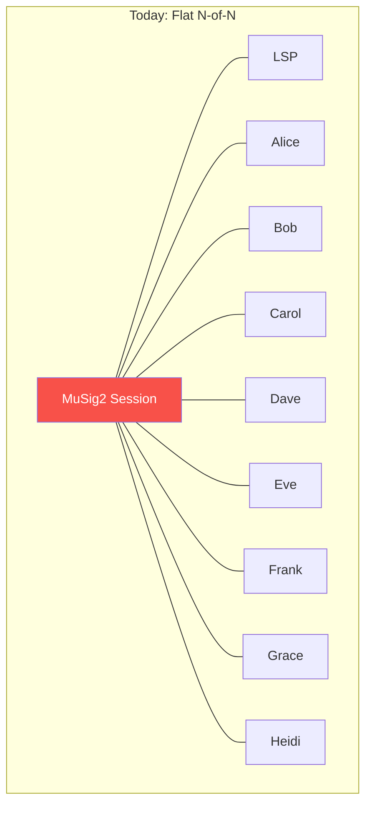
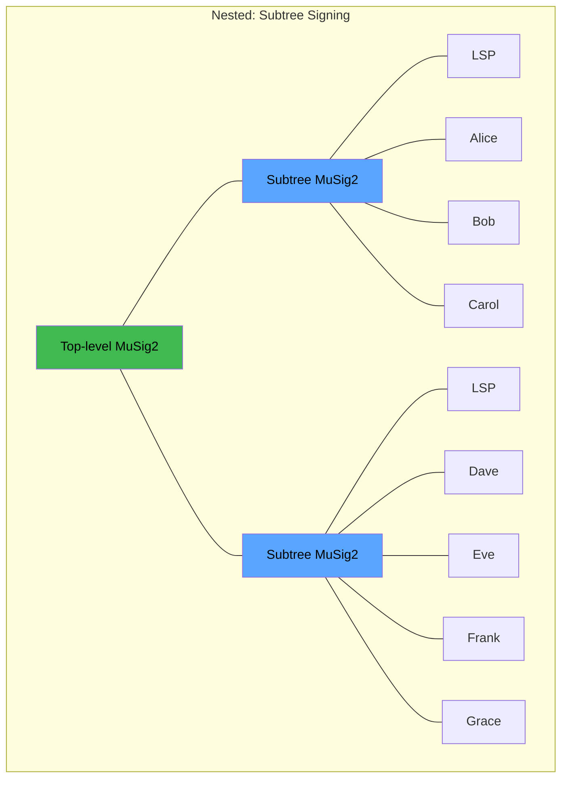
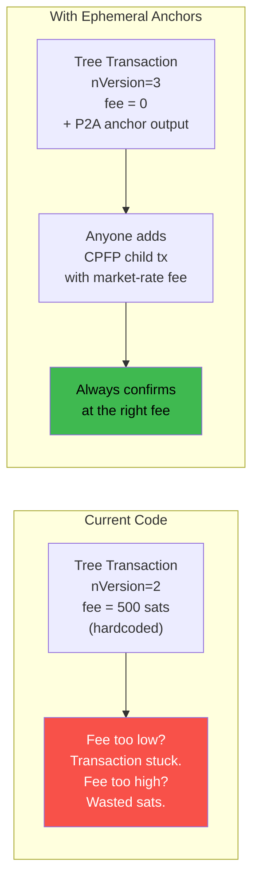
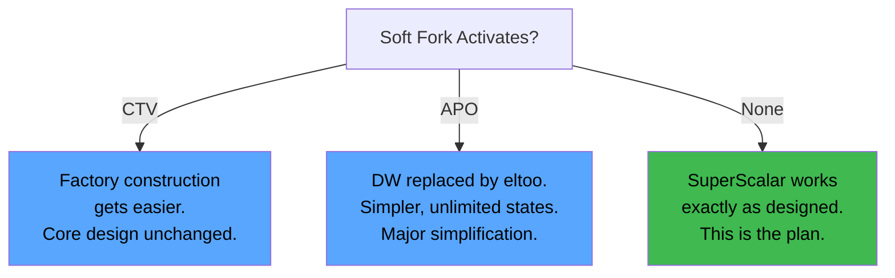

# Research Horizon

> **TLDR**: Technologies that don't exist in production yet but could meaningfully improve SuperScalar if and when they land. None of these are dependencies — SuperScalar works today without any of them.

## Nested MuSig2

**Paper**: "Nested MuSig: Secure Hierarchical Multi-Signatures" by Nadav Kohen (Chaincode Labs), February 2026. [ePrint 2026/223](https://eprint.iacr.org/2026/223)

### The Interactivity Problem

SuperScalar's biggest UX cost is **interactivity**. Every factory state update requires all N participants (clients + LSP) to be online simultaneously for a MuSig2 signing round. If one client's phone is off, that entire subtree is stuck.

All 9 participants must be online at the same time. One offline user blocks the entire signing round.

### What Nested MuSig2 Would Change

The paper proves that **composing MuSig2 sessions hierarchically** (MuSig2-of-MuSig2) is cryptographically secure. This means subtrees of a factory could sign independently and their signatures could be composed.

Only the participants in an affected subtree need to be online. If Alice wants to update her channel, only Alice, Bob, Carol, and the LSP sign — Dave through Grace don't need to be awake.

### Why This Matters for Mobile Users

SuperScalar targets people in developing nations using mobile phones. These devices are intermittently connected — battery saving, spotty data, etc. Reducing the number of people who must be simultaneously online for any given update is a direct UX improvement.

### Current Status

- **Paper**: Published, peer review ongoing
- **Library support**: None — secp256k1-zkp's MuSig2 module would need to be extended
- **Estimated timeline**: Unknown. Could be 6-12+ months before any library ships this
- **For SuperScalar**: Watch and wait. Don't build on it yet.

## Ephemeral Anchors

Unlike the other items on this page, ephemeral anchors are **fully deployed on Bitcoin** — all three required components are live. They're listed here because the SuperScalar codebase hasn't implemented them yet, even though the design docs call for them.

### The Three Components

| Component | What It Does | Where | When |
|-----------|-------------|-------|------|
| **TRUC / v3 transactions** | New transaction version with relay policy limits (1 parent, 1 child, restricted sizes) | Bitcoin Core 28.0 | October 2024 |
| **Pay-to-Anchor (P2A)** | A standard anyone-can-spend anchor output (`OP_1 <0x4e73>`) that any party can use for CPFP fee bumping | Bitcoin Core 28.0 | October 2024 |
| **Ephemeral dust exemption** | Allows zero-value P2A outputs in v3 transactions — the anchor doesn't need to carry any sats | Bitcoin Core 29.0 | April 2025 |

### Why This Matters

Factory tree transactions are signed **ahead of time** during construction. At signing time, you don't know what the fee market will look like when the transaction eventually needs to broadcast (could be months later during a force-close).

ZmnSCPxj explicitly cited P2A as the breakthrough that made Decker-Wattenhofer practical:

> *"P2A handled the issues I had with Decker-Wattenhofer — in particular, the difficulty of having either exogenous fees (without P2A, you need every participant to have its own anchor output) or mutable endogenous fees."*

### Current Code Gap

The implementation uses `nVersion=2` with a fixed 500 sat fee and no anchor outputs. The SUPERSCALAR-TECHNICAL.md design document specifies v3/P2A. This is a concrete upgrade to make.

## Soft Fork Proposals

Three Bitcoin consensus proposals would affect SuperScalar if activated. **None are activated.** SuperScalar's core value proposition is that it works without any of them.

### OP_CHECKTEMPLATEVERIFY (CTV) — BIP-119

**What it does**: Lets a transaction commit to its exact outputs at creation time, enforced by consensus.

**SuperScalar impact**: Would eliminate the need for client presence during factory construction. Currently, all participants must be online to co-sign the factory tree (N-of-N MuSig2). With CTV, the LSP could construct the tree unilaterally using covenants.

**Status**: Proposed. Not activated. Significant political debate around covenant proposals in general.

### SIGHASH_ANYPREVOUT (APO) — BIP-118

**What it does**: A new sighash flag that lets a signature apply to any transaction with compatible outputs, regardless of which input it's attached to.

**SuperScalar impact**: Would enable eltoo/LN-Symmetry, which replaces Decker-Wattenhofer entirely. Instead of a fixed number of state updates (limited by the odometer counter), eltoo allows **unlimited** state updates with a simpler mechanism. The entire [[decker-wattenhofer-invalidation]] and [[the-odometer-counter]] layers would become unnecessary.

**Status**: Proposed. Not activated.

### OP_CAT — BIP-347

**What it does**: Concatenates two stack items. Sounds simple but enables powerful covenant constructions when combined with Schnorr signatures.

**SuperScalar impact**: Indirect. Would enable competing designs and more flexible script constructions. Not directly useful for SuperScalar's current architecture.

**Status**: Proposed. Not activated.

### The Bottom Line on Soft Forks

Don't build on soft fork assumptions. If one activates, adapt then.

## FROST Threshold Signatures

**What it is**: Flexible Round-Optimized Schnorr Threshold signatures. Allows t-of-n signing (e.g., 5-of-9) instead of n-of-n.

**Why it's NOT suitable for SuperScalar**: SuperScalar's security model fundamentally depends on **n-of-n** — every participant must sign, meaning no single party (including the LSP) can move funds alone. Switching to t-of-n would mean a quorum of signers could collude to steal. That's a completely different (and weaker) trust model.

FROST is useful for other things (multisig wallets, federation signing) but is architecturally incompatible with what makes SuperScalar trustless.

## Related Concepts

- [[what-is-musig2]] — The signing protocol that nested MuSig2 extends
- [[musig2-signing-rounds]] — Current signing implementation details
- [[factory-tree-topology]] — The tree structure that nested signing would optimize
- [[soft-fork-landscape]] — Detailed analysis of each soft fork proposal
- [[security-model]] — Why n-of-n matters for the trust model
