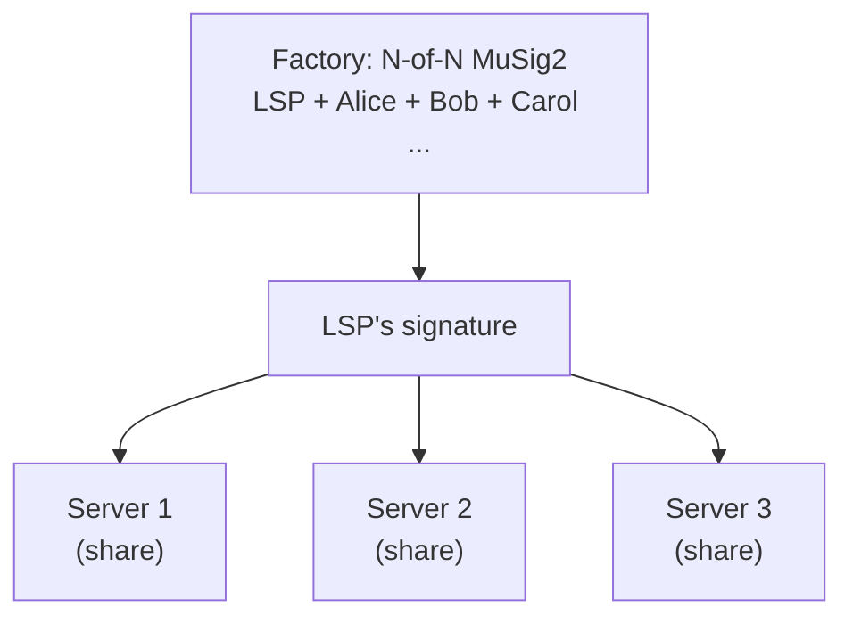

# Research Horizon

> **Summary**: Technologies that don't exist in production yet but could meaningfully improve SuperScalar if and when they land. None of these are dependencies — SuperScalar works today without any of them.

## Nested MuSig2

**Paper**: "Nested MuSig: Secure Hierarchical Multi-Signatures" by Nadav Kohen (Chaincode Labs), February 2026. [ePrint 2026/223](https://eprint.iacr.org/2026/223)

### The Interactivity Problem

SuperScalar's biggest UX cost is **interactivity**. Every factory state update requires all N participants (clients + LSP) to be online simultaneously for a MuSig2 signing round. If one client's phone is off, that entire subtree is stuck.

All 9 participants must be online at the same time. One offline user blocks the entire signing round.

### What Nested MuSig2 Would Change

The paper proves that **composing MuSig2 sessions hierarchically** (MuSig2-of-MuSig2) is cryptographically secure. This means subtrees of a factory could sign independently and their signatures could be composed.

Only the participants in an affected subtree need to be online. If Alice wants to update her channel, only Alice, Bob, Carol, and the LSP sign — Dave through Grace don't need to be awake.

### Why This Matters for Mobile Users

SuperScalar targets people in developing nations using mobile phones. These devices are intermittently connected — battery saving, spotty data, etc. Reducing the number of people who must be simultaneously online for any given update is a direct UX improvement.

| | Flat N-of-N (today) | Nested (future) |
|---|---|---|
| **Who signs** | All 9 participants | Only affected subtree (3-4 people) |
| **One phone offline** | Entire factory stuck | Only that subtree stuck |
| **Signing rounds** | 1 big round | Smaller independent rounds |

### Current Status

- **Paper**: Published, peer review ongoing
- **Library support**: None — secp256k1-zkp's MuSig2 module would need to be extended
- **Estimated timeline**: Unknown. Could be 6-12+ months before any library ships this
- **For SuperScalar**: Watch and wait. Don't build on it yet.

---

## Async Payments

### The Other Half of the Offline Problem

Nested MuSig2 helps with **signing** while some participants are offline. Async payments solve the other side: **receiving payments** while offline.

SuperScalar's target user has a phone that goes to sleep, loses signal, or runs out of battery. If someone sends them sats while they're unreachable, what happens?

The LSP acts as a buffer, holding incoming payments until the recipient comes online. Since the HTLC has a timeout, the sender gets their money back if the recipient never wakes up.

### Active Spec Work

- **Trampoline routing**: Lets the LSP handle routing decisions, reducing what the mobile client needs to compute
- **Async invoice protocol**: Being discussed in the Lightning spec — standardizing how to pay someone who isn't online
- **BOLT 12 / Offers**: The new invoice format supports reusable payment codes, which pairs naturally with async delivery

### For SuperScalar

Factory-hosted channels are a natural fit for async payments. The LSP already manages the factory and has a persistent relationship with each client. It knows which clients are in which factory and can hold payments for offline participants without additional infrastructure.

### Current Status

- **Spec work**: Active discussion, no finalized standard
- **Implementations**: Some LSPs (like Phoenix/ACINQ) already do limited async holding
- **For SuperScalar**: Important for production UX, not needed for PoC

---

## Factory Watchtowers

### Why Factories Are Harder to Watch

Standard Lightning watchtowers have a simple job: watch for a single revoked commitment transaction and broadcast a penalty transaction if it appears.

Factory watchtowers are harder because there's a **tree** of transactions to monitor, not just one.

The watchtower needs to:
1. Recognize which DW layer a revoked state belongs to
2. Broadcast the correct current state for that layer
3. Handle the [[shachain-revocation]] punishment mechanism
4. Monitor leaf channel outputs for revoked commitments too
5. Manage fee-bumping for all these transactions

### The Storage Problem

For a factory with 3 DW layers and 4 states per layer (64 epochs), the watchtower needs to store response data for each possible revoked state across each layer. With 8 clients, that's a lot of pre-signed penalty data to hold.

### Current Status

- **Research**: No published protocol for factory-specific watchtowers
- **Standard LN watchtowers**: Exist (The Eye of Satoshi, LND's built-in) but only handle simple channels
- **For SuperScalar**: Important for production security, especially for mobile users who can't monitor the chain. Not needed for PoC (regtest can be monitored manually).

---

## PTLCs (Point Time-Locked Contracts)

### Beyond HTLCs

Current Lightning uses **HTLCs** (Hash Time-Locked Contracts) for routing payments: the sender locks funds with a hash, and the recipient unlocks them with the preimage. Every hop in the route uses the **same hash**, which is a privacy leak — any two colluding nodes can tell they're on the same payment route.

**PTLCs** replace the hash/preimage with **adaptor signatures** on elliptic curve points. Each hop uses a different point, breaking the correlation.

**Red (top)**: HTLC — same hash H at every hop, linkable. **Green (bottom)**: PTLC — different point at every hop, unlinkable.

### Why This Matters for SuperScalar

SuperScalar already needs adaptor signatures for **PTLC key turnover** — the assisted exit mechanism where the client hands their factory signing key to the LSP in exchange for channel state in a new factory. The adaptor sig parameter exists in the codebase (`musig.c`) but is always passed as NULL.

PTLCs at the routing layer and PTLCs for key turnover use the same cryptographic primitive. Building one helps build the other.

### Current Status

- **Cryptography**: Well understood. Adaptor signatures on Schnorr are straightforward.
- **LN spec**: No timeline for PTLC adoption across the network
- **In SuperScalar code**: Adaptor sig parameter exists in MuSig2 API but unused
- **For SuperScalar**: Key turnover (Phase 4) needs this. General PTLC routing is a broader LN upgrade.

---

## FROST & VLS for LSP Operational Security

**FROST** (Flexible Round-Optimized Schnorr Threshold signatures) enables t-of-n signing — for example, 3-of-5 instead of 5-of-5.

### NOT for the Factory

FROST is **architecturally incompatible** with SuperScalar's factory signing. The entire security model depends on n-of-n: every participant must sign, so no single party (including the LSP) can move funds alone. Replacing n-of-n with t-of-n at the factory level means a colluding quorum could steal. Different trust model, different protocol.

### But Useful for the LSP's Own Keys

The LSP is one signer in the n-of-n. What happens inside the LSP's own infrastructure is up to the operator. If the LSP distributes its private key across multiple servers using FROST (e.g., 2-of-3), the factory stays n-of-n from everyone else's perspective — the LSP just produces one valid signature, assembled from threshold shares internally.

This gives the LSP:
- **No single point of failure** — one compromised server doesn't leak the signing key
- **Key share rotation** — rotate shares periodically without changing the public key (old leaked shares become useless)
- **Cold reserve** — keep one share offline for disaster recovery

### The Missing Piece: VLS

**FROST alone is not enough.** FROST prevents key *theft* but doesn't validate *what* is being signed. If an attacker compromises the LSP's Lightning node (not the key), they can request signatures on malicious-but-protocol-valid state transitions — and the FROST signers will happily oblige.

**VLS (Validating Lightning Signer)** solves this. VLS separates the signing function from the node and adds a policy engine that validates every signing request: is this a valid channel state? Does this HTLC make sense? Is this a revoked commitment? VLS refuses to sign anything that violates its rules.

The strongest configuration is **VLS + FROST**: policy-validated signing with distributed key shares. An attacker must compromise multiple independent servers AND bypass policy validation to steal funds.

| Layer | What It Protects Against |
|-------|------------------------|
| **FROST alone** | Key theft from a single server |
| **VLS alone** | Malicious signing requests from a compromised node |
| **VLS + FROST** | Both — distributed trust with policy enforcement |

### Current Status

| Component | Status |
|-----------|--------|
| **ZCash Foundation `frost-secp256k1-tr`** | Stable (latest 2.2.0). Most mature FROST library. The broader FROST crates were audited by NCC Group, but frost-secp256k1-tr was not in audit scope. |
| **Frostsnap / `schnorr_fun`** | Alpha. By serious cryptographers (Lloyd Fournier). No formal audit. |
| **VLS** | Beta (since June 2023), working toward production. Supports LDK and CLN. Funded by Spiral/Blockstream. |
| **FROST + LDK** | Nobody has built this yet. Feasible in theory. |
| **VLS + FROST** | On the VLS roadmap. Does not exist today. |
| **FROST inside MuSig2** | No formal security proof for this composition. |

### Practical Priority for an LSP Operator

1. **Now**: VLS — separate signing from node logic. Most impactful, most mature.
2. **Medium-term**: HSM for the VLS signer's key storage.
3. **Future**: FROST to distribute the VLS signer's key across multiple machines.

**Important caveat for solo operators**: FROST only helps if you run genuinely separate servers in different locations. Distributing key shares across processes on the same machine gains almost nothing — an attacker who compromises the host gets all shares.

## Related Concepts

- [[what-is-musig2]] — The signing protocol that nested MuSig2 extends
- [[musig2-signing-rounds]] — Current signing implementation details
- [[factory-tree-topology]] — The tree structure that nested signing would optimize
- [[soft-fork-landscape]] — Detailed analysis of each soft fork proposal
- [[security-model]] — Why n-of-n matters for the trust model
- [[ephemeral-anchors]] — The planned upgrade that's actually ready to implement now
